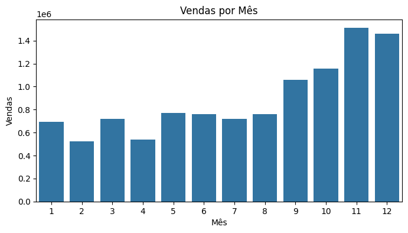
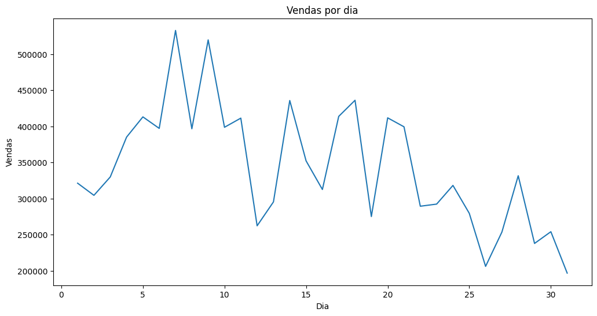
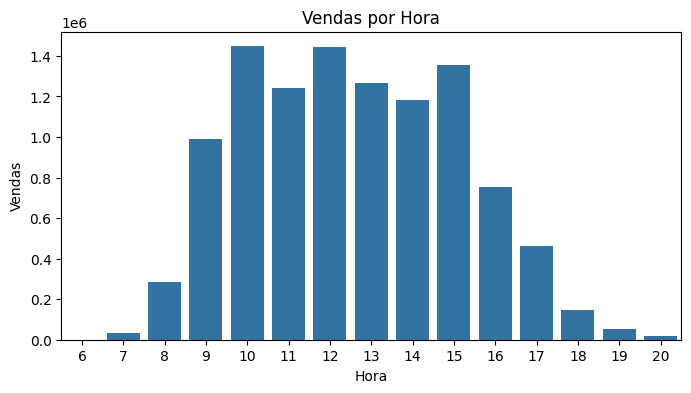
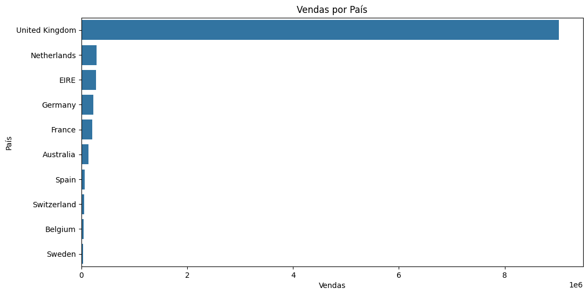

# 📊 Análise de Vendas E-commerce

## Sobre o Projeto

Este projeto analisa dados de transações de um e-commerce para extrair insights relevantes sobre comportamento de compra, produtos populares e padrões temporais que podem orientar decisões estratégicas de negócio.

## Metodologia

1. **Preparação dos dados**:
   - Carregamento e exploração inicial do dataset
   - Tratamento de valores negativos em quantidade e preço
   - Criação de variáveis derivadas (total de vendas, componentes de data)

2. **Análise exploratória**:
   - Identificação de produtos mais vendidos e mais rentáveis
   - Cálculo de indicadores financeiros (ticket médio)
   - Análise de sazonalidade (por mês, dia e hora)
   - Análise geográfica (vendas por país)

3. **Visualização dos resultados**:
   - Criação de gráficos para representar as principais descobertas
   - Formulação de insights de negócio baseados na análise

## Principais Descobertas

### 💸 Indicadores Financeiros

- **Ticket médio por pedido**: £534,40 – cada compra tem, em média, esse valor total.  
- **Ticket médio por comprador**: £2.054,27 – representa o valor médio gasto por cliente único.

## 📌 Insights de Negócio

### ⏰ Horário de pico de vendas
As vendas se concentram entre **10h e 15h**, sugerindo que campanhas promocionais e e-mails marketing devem ser priorizados nesse intervalo.

### 📅 Sazonalidade mensal
Os meses de **novembro e dezembro** apresentaram picos de faturamento. Estratégias como **descontos de Black Friday**, **Natal** e **frete grátis** devem ser intensificadas nesse período.

### 📆 Sazonalidade diária
Os dias **5 a 10 de cada mês** mostram maior volume de vendas, indicando possível relação com **pagamento de salários**. Promoções nesses dias podem potencializar o faturamento.

### 👥 Perfil de compradores
Um **pequeno grupo de clientes representa a maior parte da receita**. Estratégias de **fidelização** (como **cashback** e **clube VIP**) podem gerar grande retorno.

### 🌍 Mercado internacional
O **Reino Unido** domina as vendas, mas **Irlanda (EIRE)** e **Países Baixos** também se destacam. Há **oportunidade para campanhas regionais** nesses países.

## 🛍️ Produtos com Maior Desempenho

### Mais vendidos (em unidades):

| Produto                              | Quantidade |
|--------------------------------------|------------|
| PAPER CRAFT , LITTLE BIRDIE          | 80.995     |
| MEDIUM CERAMIC TOP STORAGE JAR       | 78.033     |
| WORLD WAR 2 GLIDERS ASSTD DESIGNS    | 55.047     |
| JUMBO BAG RED RETROSPOT              | 48.474     |
| WHITE HANGING HEART T-LIGHT HOLDER   | 37.891     |

### Mais rentáveis (em receita total):

| Produto                              | Receita Total |
|--------------------------------------|----------------|
| DOTCOM POSTAGE                       | £206.248,77    |
| REGENCY CAKESTAND 3 TIER             | £174.484,74    |
| PAPER CRAFT , LITTLE BIRDIE          | £168.469,60    |
| WHITE HANGING HEART T-LIGHT HOLDER   | £106.292,77    |
| PARTY BUNTING                        | £99.504,33     |

## Visualizações

### Vendas por Mês

*Análise da sazonalidade mensal mostrando picos de vendas em novembro e dezembro*

### Vendas por Dia
)

*Distribuição das vendas ao longo dos dias do mês*

### Vendas por Data

*Evolução das vendas ao longo do período analisado*

### Vendas por Hora

*Concentração de vendas por horário do dia, com pico entre 10h e 15h*

### Vendas por País

*Distribuição geográfica das vendas, com destaque para Reino Unido, Irlanda e Países Baixos*

## Tecnologias Utilizadas

- **Python**: Linguagem principal para análise de dados
- **Pandas**: Manipulação e análise de dados estruturados
- **Matplotlib/Seaborn**: Visualização de dados
- **Jupyter Notebook**: Ambiente de desenvolvimento interativo
